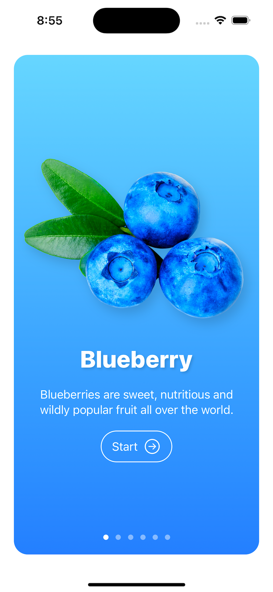
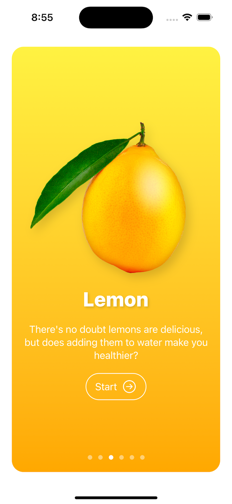

# SwiftUI + SwiftData Masterclass 📱🚀 - iOS App Development Course

This repository contains exercises, projects, and practices completed during "The Complete iOS App Development Course with SwiftUI" taught by [**Robert Petras**](https://www.udemy.com/course/swiftui-masterclass-course-ios-development-with-swift/#instructor-1) on [**Udemy**](https://www.udemy.com/course/swiftui-masterclass-course-ios-development-with-swift/). The course covers beginner to advanced-level iOS app development skills using SwiftUI, Xcode, and SwiftData.

## Course Details 📝

- **Title:** SwiftUI + SwiftData Masterclass - [The Complete iOS App Development Course with SwiftUI From Beginner to Advanced App Developer with Xcode and SwiftData](https://www.udemy.com/course/swiftui-masterclass-course-ios-development-with-swift/)
- **Rating:** 4.4 out of 5 ⭐️ (Based on 6,193 ratings)
- **Enrolled Students:** 37,900 🎓
- **Instructor:** [**Robert Petras**](https://www.udemy.com/course/swiftui-masterclass-course-ios-development-with-swift/#instructor-1)

## Content 📦

- **Exercises:** Folder containing practical exercises 💪
- **Projects:** Complete projects developed throughout the course 📲
- **Resources:** Additional resources, documents, links, etc., useful to complement learning 📚

## Objective 🎯

The purpose of this repository is to maintain a record of progress and learnings gained during the course. It serves as a reference for future practice and personal projects in iOS app development using SwiftUI.

## Courses and Platforms 🌐

The course **"The Complete iOS App Development Course with SwiftUI"** was taken on [Udemy](https://www.udemy.com/course/swiftui-masterclass-course-ios-development-with-swift/). It's a Masterclass in SwiftUI and SwiftData, highly rated and followed by a large number of students.

## Additional Resources 📚

Links to supplementary resources have been included, offering additional information and aiding in reviewing, reinforcing, or delving deeper into topics covered in the course. These resources complement learning and provide more insights into iOS app development.

## Highlighted Projects 🌟

Here are some of the prominent projects completed during the course:

### Fructus - SWIFTUI 2 iOS 14

"Fructus" is an iOS application developed as part of the iOS 14 application development curriculum with SwiftUI 2.0 framework. This app aims to provide a comprehensive learning experience covering various fundamental aspects of SwiftUI 2.0 while creating an interactive guide to different fruits. The app features an Onboarding Screen with a Page Tab View, utilizes the new App Storage for managing app state, and explores SwiftUI 2.0's enhanced features like Link View, Group Box View, and Disclosure View.

## Additional Notes 📝

Any comments, observations, or updates regarding progress in the course can be included in this section to maintain a historical record and track of learning.

Thank you for visiting my repository and reviewing my course practices!

Happy coding! 🚀📱

